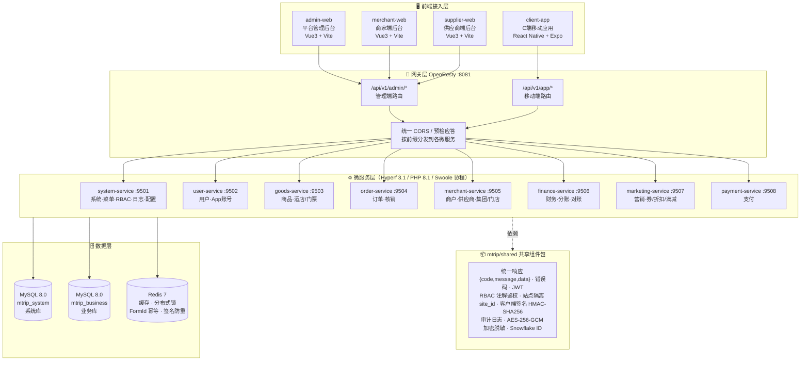
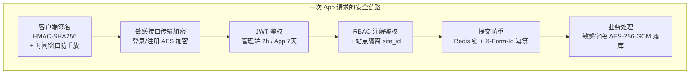
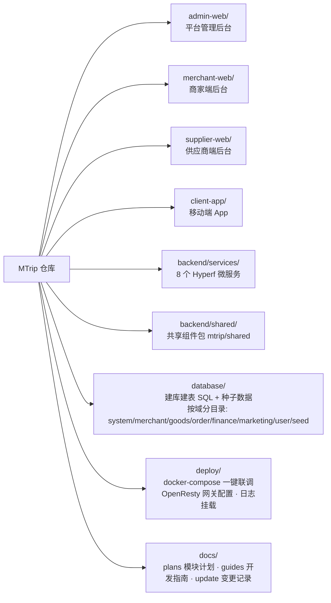

# Mtrip 平台模块与架构总览

> 用途：项目介绍与技术讲解。图示基于 `deploy/docker-compose.yml`、`backend/shared/composer.json` 及各端源码目录梳理，与实际部署保持一致。
>
> 所有图为 Mermaid 语法，可直接粘贴到支持 Mermaid 的文档工具（Markdown、语雀、飞书、PPT 插件等）中渲染。

## 一、总体架构图

## 二、安全与横切机制链路

一次 App 端请求经过的完整安全链路（管理端类似，签名环节替换为登录传输加密）：

对应环境开关（`deploy/docker-compose.yml`）：

| 机制 | 环境变量 | 默认值 |
|---|---|---|
| 客户端签名鉴权 | `MTRIP_CLIENT_SIGN` / `MTRIP_SIGN_TTL` | `true` / 3600s |
| 敏感接口传输加密 | `MTRIP_PAYLOAD_ENCRYPT` | `true` |
| 管理端登录加密密钥 | `MTRIP_ADMIN_AES_KEY`（与 admin-web `VITE_LOGIN_AES_KEY` 同值） | - |
| 提交防重 | `MTRIP_SUBMIT_LOCK` / `MTRIP_SUBMIT_LOCK_TTL` / `MTRIP_FORM_ID_TTL` | `true` / 10s / 300s |
| JWT | `MTRIP_JWT_SECRET` / `MTRIP_JWT_TTL`(2h) / `MTRIP_APP_JWT_TTL`(7d) | - |
| 全量请求日志排查模式 | `MTRIP_REQUEST_LOG` | `false` |

## 三、代码仓库模块划分

## 四、讲解要点速览

| 层次 | 组成 | 说明 |
|---|---|---|
| **前端** | 3 个 Web 后台 + 1 个移动 App | 平台/商家/供应商三套后台共用同一技术栈（Vue3 + Vite + TS），动态菜单与路由、`v-perm` 权限指令、多语言 |
| **网关** | OpenResty（Nginx + Lua） | 统一入口 `:8081`，双前缀 `/api/v1/admin/*` 与 `/api/v1/app/*` 按服务分发，集中处理 CORS 与预检应答 |
| **微服务** | 8 个 Hyperf 服务 + shared 共享包 | 每个服务独立容器（9501~9508），共享包提供统一响应、JWT、RBAC、站点隔离、签名、审计日志等横切能力 |
| **数据** | 双库 MySQL + Redis | `mtrip_system`（菜单/角色/日志/配置/客户端）与 `mtrip_business`（商户/商品/订单/财务/营销/用户）分离；Redis 承担缓存、分布式锁、幂等窗口；统一 utf8mb4/utf8mb4_bin、UTC 时区 |
| **多租户** | site_id 站点隔离 | `site_id=0` 为超管，数据按站点隔离，支撑多站点 SaaS 模式 |
| **账号体系** | 平台/商家/供应商/C端 四类 | 商户体系支持集团-门店多级实体，商家与供应商账号统一存储、按类型隔离 |
| **部署** | Docker Compose | 一键联调：MySQL 初始化 SQL 按文件名顺序自动建库建表 + 种子数据，健康检查通过后再启动业务服务，网关最后就绪 |

## 五、微服务与数据域对照

| 微服务 | 端口 | 职责 | 对应 database/ 目录 |
|---|---|---|---|
| system-service | 9501 | 菜单、角色、RBAC、日志、站点配置、存储、客户端管理 | `system/`、`seed/` |
| user-service | 9502 | 平台用户、App 端账号 | `user/` |
| goods-service | 9503 | 酒店/门票商品管理 | `goods/` |
| order-service | 9504 | 订单、核销闭环 | `order/` |
| merchant-service | 9505 | 商户、供应商、集团/门店、商家 RBAC | `merchant/` |
| finance-service | 9506 | 财务结算、多商户分账、对账 | `finance/` |
| marketing-service | 9507 | 券/折扣/满减等营销工具 | `marketing/` |
| payment-service | 9508 | 支付渠道对接 | -（复用 system 库 pay 配置） |
