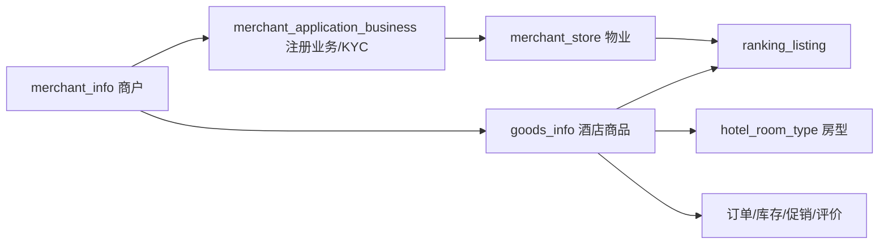
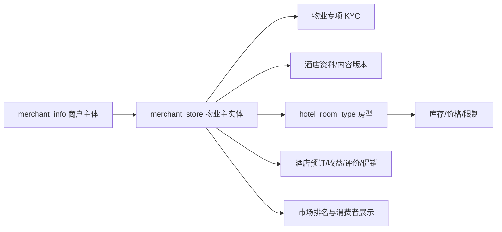

# 酒店商品收敛为物业整改计划

> 需求依据：`/Users/Admin/Projects/Mtrip海外旅游平台/documents/PRD/mTrip_Merchant App PRD_v1.0.3_中文版.md`  
> 评估日期：2026-09-14  
> 状态：已完成；批次 A、B、C、D、E、F、G 已完成

## 1. 结论与范围

PRD 将“酒店物业”定义为酒店域唯一的经营、展示和数据权限主体：商户选择物业后管理该物业的资料、房型、库存、价格、预订、促销、评价和经营数据，消费者看到的酒店列表也来自物业。当前系统同时存在 `merchant_store`（物业）和 `goods_info(goods_type=1)`（酒店商品），酒店资料与生命周期被拆成两份，再由 `ranking_listing(property_id, goods_id)` 人工绑定。这两个实体表达的是同一家酒店，继续补一对一关联会扩大重复数据、状态不一致和越权风险。

整改目标是：

1. 酒店域只保留 `property_id` 作为主标识，不再创建或使用“酒店商品”。
2. 房型、库存、预订、促销、评价、结算、排名和消费者展示都直接关联物业。
3. 商户级 KYC 与物业专项 KYC 分开；新增物业不重复商户级 KYC。
4. “全部物业 / 单个物业”由后端执行数据裁剪，不能只停留在前端菜单切换。
5. `goods_info` 暂时保留给门票等非酒店商品。本方案不把酒店 PRD 的整改扩大为门票、景区和供应商商品体系重写。

## 2. PRD 依据

- 组合层：一个商户账号管理多个物业，“全部物业”是组合入口，选择物业后进入对应领域功能。
- 酒店运营：酒店资料、房型、供应、定价、预订和发布都归属于酒店物业。
- 数据范围：工作台、图表和表格随“全部物业 / 单个物业”刷新；员工只能访问被分配的物业。
- KYC：已认证商户新增物业时，只提交物业专项认证文件，原商户 KYC 保持有效。
- 消费者展示：发布的是酒店物业；房型关联特定酒店物业并参与库存、定价和预订。

因此，当前“先建物业、再建同名酒店商品、最后手工绑定”的流程与 PRD 不一致。

## 3. 当前模型及问题

主要问题：

| 问题 | 当前表现 | 影响 |
|---|---|---|
| 双主实体 | `merchant_store` 与酒店 `goods_info` 都保存名称、地址、坐标、图片和状态 | 同一酒店可能出现两套不同资料 |
| 关系靠排名补齐 | 只有 `ranking_listing` 显式保存物业与酒店商品关系 | 未参与排名的酒店无法证明归属；排名配置承担了不属于它的主数据职责 |
| 房型挂错根 | `hotel_room_type.goods_id` 指向酒店商品 | 选择物业无法天然限制房型、库存和价格 |
| 订单缺物业 | 酒店订单只保存 `goods_id/sku_id` | 门店账号与物业选择无法安全裁剪预订和收益 |
| 前端选择无后端约束 | `selectedBusinessId` 只控制菜单模块，不进入请求上下文 | 选择某物业后仍可能读取同商户其他物业数据 |
| 生命周期重复 | 物业状态、商品审核/上下架、展示资格和排名状态并存 | 无法清楚回答“酒店现在是否可配置、可售、可展示” |
| KYC 范围混杂 | 商户申请、业务单元和物业使用同一批概念，但运行态仍靠门店/商品拼接 | 新增物业专项 KYC 无稳定的物业主键承载 |

代码扫描显示，`goods_info/goods_id` 直接影响至少 41 个后端 PHP 文件和 17 个前端文件；其中同时包含酒店与门票逻辑，不能直接全表改名或一次性删除。

## 4. 目标领域模型

### 4.1 唯一主实体

直接复用现有 `merchant_store.id` 作为 `property_id` 和物业唯一事实源，不新建另一张物业主表，也不重新分配物业 ID。给现有表补齐酒店资料与生命周期字段，使用同一个 `property_id` 贯穿所有酒店业务。建议字段分为四组：

- 归属：`site_id`、`merchant_id`、`business_type`、`property_name`、国家、城市、地址、坐标。
- 认证：`kyc_status`、`kyc_version`、`kyc_submitted_at`、`kyc_approved_at`。
- 经营：`operating_status`、PMS/Channel Manager 配置状态。
- 发布：`content_status`、`publish_status`、`published_at`、`display_enabled`。

酒店商品中现有的描述、星级、网站、联系方式、设施、政策、媒体和入住/退房时间合并进物业记录；内容审核草稿与历史放入以 `property_id` 为外键的版本表。为避免本轮再引入一层一对一详情模型，不单独创建 `hotel_property_profile`。代码、API 和界面统一使用 Property/物业术语；`merchant_store` 的物理表名可在全部调用稳定后另做无业务含义的重命名，不作为本次收敛的前置条件。

### 4.2 生命周期拆分

不要再用一个 `status` 同时表达审核、营业和发布：

| 维度 | 建议状态 | 说明 |
|---|---|---|
| 物业 KYC | 草稿、待审核、审核中、已通过、已驳回、待重交 | 决定能否进入酒店运营配置 |
| 内容审核 | 草稿、待审核、已通过、已驳回 | 采用版本表；新版本审核期间保留旧已发布内容 |
| 发布状态 | 未发布、已发布、已下线 | 决定消费者是否可见 |
| 经营状态 | 营业、停业、平台暂停、归档 | 决定能否继续销售和履约 |

消费者可见门禁统一为：商户有效、未拉黑、物业 KYC 已通过、物业内容已通过且已发布、物业展示资格开启、至少一个已发布房型可售。市场排名只决定展示顺序，不再负责绑定物业与另一个酒店实体。

### 4.3 关联字段整改

| 现有位置 | 目标 |
|---|---|
| `hotel_room_type.goods_id` | `hotel_room_type.property_id` |
| `hotel_room_type_revision.goods_id` | `property_id` |
| 酒店 `goods_daily_stock.goods_id` | `property_id`；房型仍由 `sku_id` 标识 |
| 酒店 `goods_stock_log.goods_id` | `property_id` |
| 酒店 `goods_refund_rule.goods_id` | `property_id` 或 `room_type_id` |
| 酒店 `order_main.goods_id/sku_id` | `property_id/room_type_id`；保留名称、政策和价格快照 |
| 酒店收藏 `user_favorite.goods_id` | `property_id` |
| `goods_review.goods_id` | 酒店评价改为 `property_id` |
| 营销 `goods_ids/sku_ids` | 酒店活动改为 `property_ids/room_type_ids` |
| `ranking_listing(property_id, goods_id, business_id, merchant_id)` | 只保留 `property_id` 和排名配置 |

门票路径继续使用 `goods_id/sku_id`。过渡期字段必须按 `order_type/sku_type` 做互斥校验，防止酒店记录同时写入新旧两个主键后产生歧义。

## 5. KYC 与新增物业流程

### 5.1 初始入驻

1. 商户提交公司/主体资料和初始物业清单。
2. 创建商户级 KYC 文档与每个初始物业的专项文档；物业先取得稳定 `property_id`，状态为 KYC 草稿。
3. 管理员分别审核商户级资料和各物业专项资料。
4. 商户级 KYC 与全部首批物业要求通过后，激活商户账号并生成一次访问码。
5. 每个 KYC 已通过的物业解锁酒店资料、房型和库存配置；仍需完成内容审核和发布才能面向消费者。

### 5.2 已认证商户新增物业

1. 在 Add New Property 第 1 步保存物业草稿。
2. 第 2 步按物业 KYC 模板上传文件并提交审核。
3. 只审核该 `property_id` 的专项文档，不改变既有商户 KYC，不重新生成访问码，也不影响其他物业运营。
4. 通过后解锁该物业的 Dashboard 和运营模块；被驳回时保留原因、版本和重交入口。

建议给 `merchant_verify_document` 增加明确的 `scope_type=merchant/property` 与 `property_id`，继续复用现有文件版本、下载权限、逐份审核和事件日志能力。`merchant_application_business` 仅保留为历史入驻来源，不再作为商户端运行时的“物业”。

物业 KYC 模板继续平台可配置，模板增加 `scope_type=property`。Figma 的三项资料可作为酒店物业模板种子，不能在前端硬编码成唯一规则。

## 6. 所选物业的数据作用范围

### 6.1 请求上下文

- 商户前端保存 `selectedPropertyId`，具体物业请求统一发送 `X-Mtrip-Property-Id`。
- “全部物业”不发送该头或发送空值；后端按账号可访问物业集合聚合。
- 中间件验证物业与当前站点、商户/集团、员工分配、KYC 和状态的关系；伪造 ID 返回无数据权限。
- 要求单物业的写接口在“全部物业”上下文中直接拒绝，批量接口必须显式提交并验证 `propertyIds[]`。

### 6.2 账号范围

| 账号 | 全部物业 | 指定物业 |
|---|---|---|
| 集团账号 | 集团内已授权商户的可见物业 | 必须属于集团与本站点 |
| 商户账号 | 本商户全部可见物业 | 必须属于本商户与本站点 |
| 员工账号 | 被分配的物业集合 | 必须在员工物业授权表中 |
| 物业账号 | 仅自身物业 | 不允许切换到其他物业 |

Dashboard、房型、库存价格、预订、收益、促销、评价、住客消息和相关通知都遵循该上下文。员工管理、商户资料、支持和安全设置保持商户级，但员工分配页面使用物业集合授权。

## 7. API 与界面收敛

### 7.1 商户端

- `/merchant/properties/*` 同时承载物业列表、基本信息、KYC 状态、酒店资料草稿、提交审核和发布状态。
- `/merchant/rooms/*` 参数从 `goodsId` 改为 `propertyId`。
- `/merchant/availability/*`、`/merchant/order/*`、Dashboard、收益、促销和评价读取统一物业上下文。
- 移除酒店场景的 `/merchant/goods` 页面和菜单；“Hotel Property”页就是原酒店商品编辑能力与现物业资料的合并页。
- All Properties 读取真实物业及其 KYC、内容审核、发布、房型和告警统计，不再读取 `merchant_application_business` 伪装成物业。

### 7.2 管理端

- 物业 KYC 使用独立队列或在现有验证工作台中增加 `scope=property` 队列；复用同一文档审核组件。
- 酒店内容审核以物业版本为单位；房型继续独立版本审核。
- 市场排名候选直接选择已具备展示资格的物业，不再选择“物业 + 酒店商品”组合。
- 原“酒店商品管理”改为“酒店物业管理”，门票商品管理保持原路径。

### 7.3 消费者端

- 新增 `/api/v1/app/hotels/list|detail|calendar|reviews`，直接查询物业及房型。
- `/api/v1/app/goods/*` 逐步只服务门票等非酒店商品。
- 酒店详情、收藏、下单和 Trip 参数改用 `propertyId/roomTypeId`。
- 兼容期可以在返回 DTO 中保留一版 `id`/`goodsId` 别名，但服务端禁止继续创建酒店 `goods_info`。

## 8. 数据迁移策略

采用“扩展现有物业结构 → 确定性回填 → 影子校验 → 切换读写 → 清理旧酒店数据”的顺序，不新建第三个物业主实体，也不直接在线改名或猜测映射。

### 阶段 0：冻结口径与数据盘点

- 禁止新增酒店 `goods_info`；功能开发期间旧接口只允许读取和必要修正。
- 输出每个站点的四类清单：已显式一对一关联、只有物业、只有酒店商品、重复/跨商户/跨站冲突。
- 唯一可信映射来源是现有显式关系和人工确认；名称、地址、主门店和创建顺序不能作为自动映射依据。

验证：冲突和未映射数量可复核；未达到 0 前不得执行破坏性清理。

### 阶段 1：扩展物业主模型

- 扩展 `merchant_store` 的物业资料、KYC、内容审核、发布和经营状态字段；新增物业内容版本/历史和员工物业授权表。
- 给 KYC 文档及酒店依赖表增加 `property_id`。
- 保留 `merchant_store.id` 不变，从显式关联的酒店 `goods_info` 合并展示资料。
- 生成独立的迁移审计清单保存 `goods_id → property_id` 旧映射，供核对与回滚使用；旧 ID 不进入新业务接口。

验证：站点、商户、KYC、名称/位置字段迁移前后逐条对照；重复唯一键和跨主体关系为 0。

### 阶段 2：迁移房型与交易链路

- 房型、房型审核版本、库存、价格、限制、库存日志、订单和结算回填 `property_id`。
- 酒店下单、库存锁定/扣减/释放、取消退款和 No-show 全部改用物业与房型主键。
- 历史订单保留酒店名、房型名、价格、政策等快照，不因当前物业资料变化而改写。

验证：每个酒店房型、库存日历和酒店订单都能解析到唯一物业；迁移前后价格、库存、订单金额与状态一致。

### 阶段 3：迁移运营与消费者链路

- Dashboard、预订、收益、促销、评价、住客消息和通知接入物业上下文。
- 排名发布快照删除 `goods_id` 依赖，直接渲染物业资料。
- 消费者酒店列表、详情、收藏和下单切换到 hotel API。

验证：全部物业与单物业聚合相等；具体物业之间无串数；已发布酒店在消费者端的名称、图片、房型、价格、评分和排序保持一致。

### 阶段 4：切换与清理

- 关闭酒店 `/merchant/goods` 与 `/app/goods` 分支，拒绝 `goods_type=1` 新写入。
- 清除运行时代码中的酒店 `goods_id`，删除 `ranking_listing.goods_id` 等冗余字段。
- 所有未映射酒店商品处理完毕并经过备份、演练和观察期后，再归档/删除酒店 `goods_info` 行。
- `merchant_store` 继续作为物业物理表；全部调用稳定后可单独重命名为 `merchant_property`，该技术清理不改变 ID、关系或业务语义。

验证：代码中不存在酒店业务读取 `goods_info`；酒店新建、KYC、配置、审核、发布、搜索、下单、履约、退款和结算端到端通过。

## 9. 实施批次与成功标准

| 批次 | 交付目标 | 核心验证 |
|---|---|---|
| A | 模型与只读迁移报告 | 所有现有酒店数据被分组，零猜测映射 |
| B | 物业 KYC 闭环 | 新增物业只提交专项资料；审核不影响商户及其他物业 |
| C | 物业资料与房型 | 不创建酒店商品即可完成物业资料、房型和库存配置 |
| D | 物业数据范围 | 全部/单物业及员工授权由后端强制隔离 |
| E | 预订与财务 | 下单、库存、履约、退款、收益和结算均可追溯到物业 |
| F | 消费者与排名 | 物业直接发布、排名、搜索、详情、收藏和预订 |
| G | 旧模型退役 | 酒店域无 `goods_info/goods_id` 运行时依赖 |

### 9.1 批次 A 执行记录（2026-09-14）

- [x] 新增只读审计脚本 `scripts/audit-hotel-property-mapping.sh`，同时识别 `ranking_listing` 和 `merchant_store_goods` 两类显式 ID 关系。
- [x] 输出分站点汇总与六类明细：有效一对一、仅物业、仅旧酒店商品、冲突关系、未映射房型、未映射酒店订单。
- [x] 脚本会话强制 `TRANSACTION READ ONLY`，不使用名称、地址、主门店标记或创建顺序推断。
- [x] 本地基线报告见 [2026-09-14 酒店商品→物业映射审计](./audits/2026-09-14-hotel-property-mapping.md)：旧酒店商品、房型、酒店订单和各类映射冲突均为 0，退役门禁 `PASS`。
- [x] 现有 1 条 `business_type` 为空的门店仅列为“未分类”，没有酒店证据，本批次不自动转换。

本地空数据基线通过只说明当前环境可安全继续扩展式改造；其他环境在执行 G 批次物理清理前仍必须独立运行同一审计。

### 9.2 批次 B 执行记录（2026-09-14）

- [x] 新增迁移 `V20260914095000__add-property-kyc.sql`，在 `merchant_store.id` 上扩展物业 KYC 状态、模板和版本字段，并给文档、修订和事件补充明确的 `scope_type/property_id`。
- [x] 新增酒店物业专项 KYC 模板，初始必传项为 Business Registration、Hotel Operating License、Owner ID / Passport；模板由后端读取，前端不硬编码清单。
- [x] 新增物业列表、草稿保存、KYC 查询、上传和提交接口；集团、商户及物业账号按站点和归属校验，写权限键与商户菜单种子一致。
- [x] 商户端 Add Property 第 1 步保存真实物业草稿，第 2 步完成三项资料上传、替换、提交和驳回后续传；All Properties 改为读取真实 `merchant_store`。
- [x] 管理端复用文档审核工作台审核物业资料，审核状态只同步对应 `property_id`；物业 KYC 通过、驳回和重交均不调用商户访问码流程。
- [x] 隔离库集成测试 14 项全部通过，覆盖跨站拒绝、MIME 校验、版本留痕、部分审核、驳回重交和最终通过；两次关键断言确认商户访问码及其他物业状态均不变化。
- [x] 本地迁移账本为已执行 5、待执行 0；PHP 8.1 容器语法检查、merchant-web/admin-web 生产构建、迁移命名校验和 `git diff --check` 通过。

### 9.3 批次 C 执行记录（2026-09-14）

- [x] 新增并应用迁移 `V20260914103000__add-property-content-room-inventory.sql`：扩展物业资料、内容审核、发布和经营字段，新增物业内容版本及旧酒店商品显式映射审计表；迁移文件应用后已冻结。
- [x] 旧映射只读取 `ranking_listing` 与 `merchant_store_goods` 中站点、商户和关系一致的显式关联，仅回填无歧义一对一结果；本地映射冲突、未映射房型和未映射酒店库存均为 0，退役门禁继续为 `PASS`。
- [x] 商户端已打通物业资料草稿、提交审核和发布；管理端增加物业资料审核队列及版本差异。物业 KYC、内容审核、房型审核和发布状态保持独立，待审或驳回的新版本不覆盖已批准资料。
- [x] 房型、房型版本、库存、退款规则和库存日志切换到 `property_id`；新房型和酒店库存不再创建或写入酒店商品键，过渡字段 `goods_id` 保留为 `0` 供后续退役核对。
- [x] 商户端和管理端拒绝新建 `goods_type=1` 酒店商品，门票商品创建回归通过；存量酒店商品只保留兼容读取和必要修正，运行时彻底移除安排在批次 G。
- [x] 新增权限 `mch:properties:profile-edit|profile-submit|publish` 与 `merchant:property:content-audit` 已核对后端注解、前端 `v-perm`、菜单种子和本地数据库实际记录，四个键均各一条。
- [x] 隔离库 17 项房型/库存断言、12 项物业内容生命周期断言和 14 项物业 KYC 回归全部通过；覆盖空批量选择、部分非法房型、跨站/跨商户/跨物业访问、物业账号撤回边界、已批准内容保留和发布门禁。
- [x] 本地迁移账本为已执行 6、待执行 0；20 个相关 PHP 文件通过 PHP 8.1 容器语法检查，`merchant-service` 与 `goods-service` 重启后健康，merchant-web/admin-web 生产构建、迁移命名校验和 `git diff --check` 通过。

本批次没有可用的已登录浏览器会话，因此未完成物业资料与管理端审核页的登录态 Figma 视觉走查；两端生产构建已通过，该项作为界面验收限制保留，不影响后端收敛门禁。

### 9.4 批次 D 执行记录（2026-09-14）

- [x] 新增并应用迁移 `V20260914110000__add-employee-property-scope.sql`，以 `merchant_employee_property(admin_id, property_id)` 显式存储员工物业授权；迁移应用后已冻结。
- [x] 商户鉴权中间件统一解析 `X-Mtrip-Property-Id`：空值表示全部已授权物业，非法格式返回 `40001`，伪造或未授权 ID 返回 `40302`；单物业写入在全部物业上下文返回 `40901`。
- [x] 集团主账号、商户主账号、员工账号和物业账号分别按集团商户集合、本商户、显式分配集合和固定物业执行后端范围；所选物业继续收窄房型、房量、物业 KYC 和物业资料读写。
- [x] 商户端将 `selectedBusinessId` 收敛为 `selectedPropertyId`，会话内持久化并随业务请求发送物业头；切换器改用真实 `merchant_store.id`、KYC/内容/发布/经营状态，菜单启动请求不受失效物业选择阻断。
- [x] 子账号页面新增物业权限选择与 `mch:account:property-assign` 写权限；角色与物业范围保持独立、幂等的保存动作，下级管理员只能替换自己可访问范围内的授权。
- [x] 后端注解、商户菜单种子、前端 `v-perm` 和实际数据库中 `mch:account:property-assign` 均已对齐，实库记录为 1 条；隔离库与开发库的物业范围测试夹具均为 0。
- [x] 隔离库 13 项物业范围、17 项房型/库存、12 项物业内容和 14 项物业 KYC 回归全部通过；最新 PHP 8.1 语法检查、merchant-web 生产构建、迁移命名/账本校验与 `git diff --check` 通过，迁移账本为 7/7，五个商户业务服务重启后 `healthz` 正常。

本批次没有可用的已登录浏览器会话，员工物业授权和物业切换的登录态 Figma 视觉走查尚未执行；类型检查和生产构建已通过。

### 9.5 批次 E 执行记录（2026-09-14）

- [x] 新增并应用迁移 `V20260914112115__add-property-order-finance.sql`，给订单、退款、资金流水、分账分录和商户结算单增加 `property_id/room_type_id` 及物业查询索引；结算唯一键改为商户、物业和周期组合，迁移应用后已冻结。
- [x] 历史酒店订单只在订单 `goods_id/sku_id` 与房型已有 `goods_id/property_id` 显式关系一致，且站点、商户归属一致时回填；退款、分账和流水再由已确定订单传播。隔离库正向回填四表一致，商品与房型不匹配时保持 `property_id/room_type_id=0`，没有名称或商户数量推断。
- [x] 单酒店和 Trip 下单统一接受 `propertyId/roomTypeId`，酒店订单、库存及日志写物业/房型键并将过渡 `goods_id/sku_id` 置 `0`；旧参数只在房型携带明确物业且商品关系一致时兼容解析。门票继续写 `goods_id/sku_id`，物业/房型键为 `0`。
- [x] 待支付酒店订单付款会重新锁定物业经营门禁；取消、库存释放/扣减/退款回补、取消政策快照、用户退款、商户退款、平台退款到账和分账分录均沿用订单的物业与房型归属。PMS/Channel Manager 同步标识切换为物业 ID。
- [x] 商户预订、通用订单、经营看板、收益和结算按 `MerchantContext::scopePropertyIds()` 裁剪酒店数据；单物业上下文不能读取其他物业或未归属的历史商户级结算。门票订单仍按商户范围读取，预订 CSV 下载显式携带所选物业头。
- [x] 隔离库 33 项订单双路径、16 项看板和 6 项收益结算断言通过；B-D 的 14 项 KYC、12 项内容、13 项范围和 17 项房型/库存断言全部回归通过，测试夹具清理为 0。
- [x] 16 个相关 PHP 文件通过 PHP 8.1 语法检查，merchant-web 生产构建、迁移命名校验和 `git diff --check` 通过；本地迁移账本为 8/8，MySQL、订单主池、订单 App 池和财务服务健康。

历史 `property_id=0` 商户级结算无法确定拆分来源，保留为管理端审计数据，不在商户物业收益接口中展示。营销活动的物业归属与看板活动数随批次 F 一并切换。

### 9.6 批次 F 执行记录（2026-09-15）

- [x] 新增并应用迁移 `V20260914123000__add-property-consumer-ranking-marketing.sql`：收藏、评价和营销活动目标增加 `property_id`，酒店优惠券范围增加 `property_ids/room_type_ids`，历史数据只按已确认映射回填；迁移应用后已冻结。
- [x] 消费者酒店列表、详情、日历和评价切换到 `/api/v1/app/hotels/*`，直接读取已发布物业和房型；客户端搜索、详情、收藏和预订统一传递 `propertyId/roomTypeId`。门票列表、详情、收藏、票种和下单继续使用 `goods_id/sku_id`。
- [x] 酒店收藏和评价改以 `property_id` 隔离站点、用户、商户及所选物业；酒店排名候选、配置和发布快照只保留 `property_id`，消费者展示仍实时执行商户、KYC、内容、发布、经营、展示资格和可售房型门禁。
- [x] 酒店营销范围使用 `property_ids/room_type_ids`，门票营销范围保留 `goods_ids/sku_ids`；管理端校验物业、房型、商品和票种的站点与父级归属，商户活动及 Dashboard 活动数按全部或所选物业裁剪。
- [x] 管理端优惠券界面分开选择酒店物业/房型和门票商品/票种，消费者券详情展示两类适用范围；admin-web、merchant-web 生产构建、client-app 类型检查及三份客户端 i18n JSON 解析均通过。
- [x] 隔离库排名发布完整套件 68 项、消费者酒店与评价完整套件、Dashboard 17 项、酒店/门票订单券范围 5 项、物业收藏 5 项、管理端券范围 7 项全部通过；B-E 的 KYC 14 项、内容 12 项、物业范围 13 项、房型/库存 17 项、订单 33 项、Dashboard 17 项和收益结算 6 项共 112 项回归通过。
- [x] 61 个 A-F 改动及新增 PHP 文件通过 PHP 8.1 语法检查；迁移账本为 9/9，迁移命名、`git diff --check` 通过，F 新增 6 列齐全，酒店排名发布快照含 `goods_id` 的记录和测试夹具残留均为 0。
- [x] goods、order、user、marketing 的主池与 App 池、merchant-service 和 gateway 重启后全部健康；带合法客户端签名的 `GET /api/v1/app/hotels/list` 经网关返回 HTTP 200、`code=0` 和标准分页结构，临时签名客户端已清理。

本批次没有可用的已登录消费者、商户或管理端浏览器会话，因此未执行登录态 UI/Figma 联动走查；三端构建或类型检查和真实签名网关请求已通过，该限制不影响数据与接口收敛门禁。

### 9.7 批次 G 执行记录（2026-09-15）

- [x] 物理清理前重新生成 [2026-09-15 酒店商品退役门禁](./audits/2026-09-15-hotel-property-retirement-gate.md)，酒店商品、仅商品、未映射房型、未映射订单、重复、跨站、跨商户和无效关系均为 0，门禁 `PASS`；无酒店证据的 1 条未分类门店未自动转换。
- [x] 新增并应用迁移 `V20260915090000__retire-hotel-goods-model.sql`：创建 `hotel_goods_archive` 审计归档，清除酒店共享表旧键及商品关系，删除酒店分类与酒店商品，并物理删除 `hotel_room_type.goods_id`、`hotel_room_type_revision.goods_id`、`ranking_listing.goods_id/business_id`；迁移应用后已冻结，账本为 10/10。
- [x] 隔离库先构造未映射酒店商品，确认迁移会在归档和删列前阻断；再构造完整旧酒店关系，确认商品归档、共享键清零、关联及菜单清理、门票保留，并连续执行迁移两次验证幂等。
- [x] 管理端、商户端和消费者商品接口收敛为门票，旧酒店商品列表、详情、评价、房型写入与库存分支以及旧菜单入口已删除；酒店下单不再接受 `goodsId/skuId`，支付归属、库存、退款继续使用 `property_id/room_type_id`，门票保持 `goods_id/sku_id`。
- [x] 管理端删除旧酒店商品页，分类、库存、审核和商品组件固定为门票；商户商品页明确为门票商品。门票编辑、删除、票种、分类和强制下架权限已补齐菜单种子及现有环境迁移，注解、前端 `v-perm` 与菜单键一致。
- [x] G 专项 17 项及 A-G 共 242 项隔离回归通过，覆盖房型、KYC、物业内容、物业范围、订单、Dashboard、收益、排名、消费者酒店、优惠券、收藏及门票链路；65 个改动/新增 PHP 文件通过 PHP 8.1 语法检查，admin-web/merchant-web 生产构建、client-app 类型检查、迁移命名和 `git diff --check` 通过。
- [x] 迁移后开发库酒店商品、旧字段和旧菜单均为 0；全部主池、App 池和网关健康。合法签名请求验证酒店与门票分页为 HTTP 200、`code=0` 和统一分页结构，旧 `goodsType=1` 返回 HTTP 400、`code=40001`，临时签名客户端已清理。

本批次没有可用的已登录消费者、商户或管理端浏览器会话，因此未执行登录态 UI/Figma 联动走查；三端构建或类型检查、真实签名网关请求和完整业务回归已通过。

### 9.8 新增物业 KYC 请求上下文修复（2026-09-15）

- [x] 定位“All Properties”下新增物业上传 KYC 提示“请先选择具体物业”：新物业已经创建并返回有效 `propertyId`，但上传请求只在 multipart 表单中传 ID，没有提供后端单物业写门禁读取的 `X-Mtrip-Property-Id`。
- [x] 物业 KYC 上传/提交、已有物业基本信息更新、物业资料保存/提交及发布请求显式携带页面正在操作的物业 ID；物业详情读取使用同一上下文，避免全局选择与当前页面目标不一致。
- [x] 全局 Axios 拦截器仅在调用方未显式提供物业头时补充会话中的 `selectedPropertyId`，不会再以“All Properties”空上下文或另一物业覆盖页面目标；后端单物业权限校验保持不变。
- [x] merchant-web 生产构建、隔离库 13 项物业范围和 14 项物业 KYC 回归、`git diff --check` 通过；未使用真实登录账号执行浏览器文件上传。

每个批次必须包含数据库迁移幂等测试、权限键与菜单种子核对、站点隔离测试、PHP 语法/服务测试、前端类型检查与构建。涉及页面的批次按对应 Figma 节点做桌面和窄屏视觉核对。

## 10. 必测场景

- 初始商户含多家物业，部分物业 KYC 驳回时不能提前开放其运营入口。
- 已认证商户新增物业时不重新生成访问码、不改变既有物业状态。
- 物业 KYC 驳回、重交和逐份审核版本完整留痕。
- 集团、商户、员工和物业账号的全量/单物业范围；伪造站点、商户和物业 ID 全部拒绝。
- 同一商户两家物业的同名房型、库存、预订、评价和促销不能串联。
- 全部物业指标等于可访问物业指标的确定性聚合，分页与导出使用同一范围。
- 物业内容新版本待审时，消费者继续看到上一批准版本。
- KYC 撤销、商户暂停/拉黑、物业停业或展示资格关闭时，消费者实时不可见，但历史订单仍可审计和按规则履约。
- 门票商品、票种、门票订单和门票促销不受酒店迁移影响。

## 11. 风险与控制

| 风险 | 控制措施 |
|---|---|
| 存量物业与酒店商品没有可靠映射 | 只认显式关系；输出人工处理清单，禁止名称猜测 |
| 一次切换影响订单和库存 | 先增列与回填，影子比对后按链路切换；保留旧键观察期 |
| 新旧接口同时写导致漂移 | 设置明确切换窗口；不建设长期双向同步 |
| 酒店整改误伤门票 | 所有迁移与代码分支按酒店类型限定；门票保留 goods 模型并做回归 |
| 状态继续混用 | KYC、内容审核、发布、经营四个维度分列并分别测试 |
| 只在前端过滤造成越权 | 物业上下文由中间件验证，控制器和导出接口复用同一范围查询 |

## 12. 实施前需要确认的决策

本方案建议默认采用以下口径：

1. “只保留物业”限定于酒店域；门票继续保留商品概念。
2. 复用 `merchant_store.id` 作为 `property_id` 并原地扩展，避免创建第三个物业实体；物理表重命名留到业务切换稳定后。
3. 商户级 KYC 与物业专项 KYC 分离，物业批准不重新生成商户访问码。
4. 酒店内容审核、房型审核与 KYC 审核分开，任一通过都不能替代另外两项。
5. 所有历史未显式关联的酒店商品必须人工确认或归档，系统不自动猜测对应物业。

上述五项确认后再进入批次 A；如果任何一项改变，应先调整目标模型和迁移门禁，避免中途产生第三套兼容模型。
